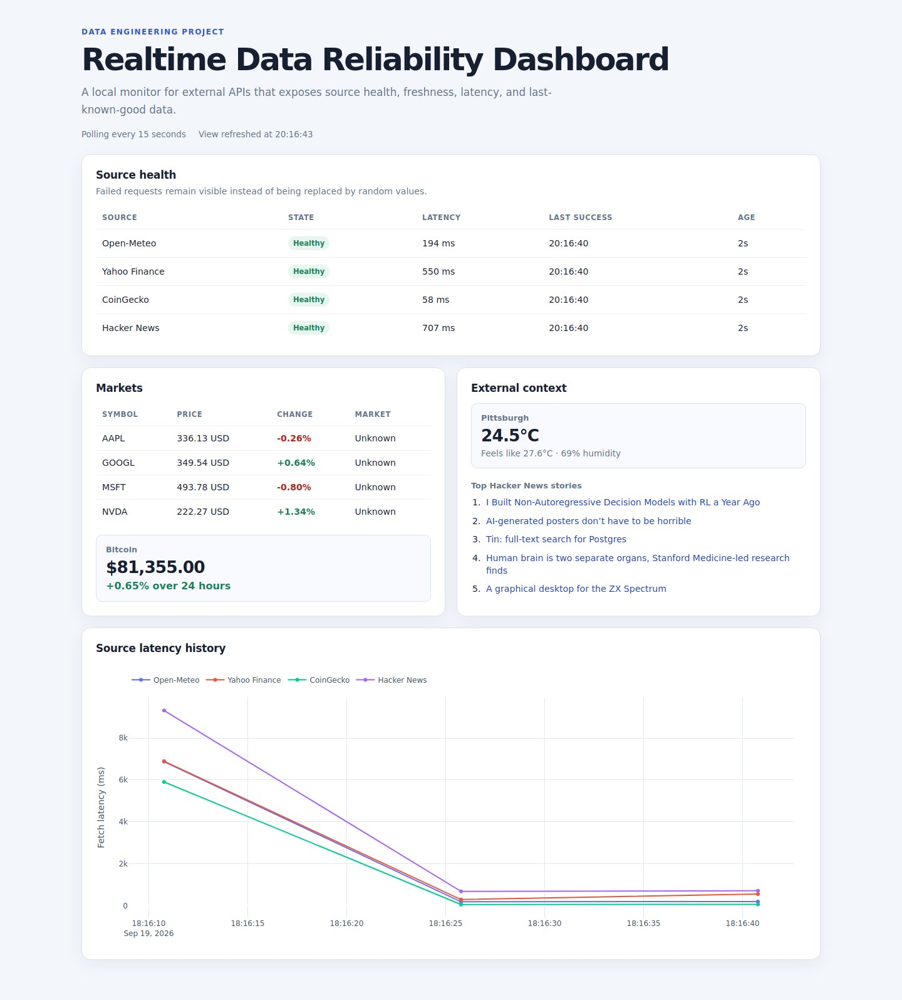

# Realtime Data Reliability Dashboard

This project is a small monitoring application for external data sources. It polls several public APIs, records request latency and freshness, and makes failures visible instead of silently replacing them with random demo values.

The original version was a collection of unrelated live-data cards. I refactored it around a narrower engineering question: how should a dashboard behave when the services behind it are slow, partially available, or temporarily offline?

## Preview



Screenshot from the running application using live public APIs, captured on
September 19, 2026 with a 15-second polling interval. The normal default is 60
seconds. Source availability and values change over time; failures remain visible.

## What it demonstrates

- Concurrent polling of independent data sources
- Explicit `healthy`, `degraded`, `stale`, and `error` states
- Last-known-good data retention after a failed refresh
- Per-source latency and freshness tracking
- Bounded in-memory health history
- Environment-based configuration
- Unit tests for failure and fallback behavior

## Data sources

| Source | Data | Access |
| --- | --- | --- |
| Open-Meteo | Current weather for a configured location | Public API |
| Yahoo Finance | Intraday quotes for configured stock symbols | Public chart endpoint |
| CoinGecko | Bitcoin price and 24-hour change | Public API |
| Hacker News | Current top stories | Firebase API |

The dashboard never presents generated values as live data. When a source fails, its state changes to `stale` if a previous successful response is available, or `error` if no valid response has been received.

## Repository structure

```text
.
├── app.py                  # Dash layout and rendering callbacks
├── config.py               # Environment-based settings
├── data_sources.py         # External API adapters
├── reliability.py          # Concurrent polling and health state
├── benchmark.py            # Sequential/concurrent refresh measurements
├── run.py                  # Local application entry point
├── assets/
│   └── styles.css          # Responsive dashboard styles
├── tests/
│   ├── test_data_sources.py
│   └── test_benchmark.py
├── docs/                   # Runtime screenshot and raw benchmark results
├── .github/workflows/
│   └── tests.yml            # Python 3.11/3.12 unittest CI
├── .env.example
└── requirements.txt
```

## Run locally

Use Python 3.11 or 3.12. Create a virtual environment and install the application dependencies:

```bash
python -m venv .venv
```

On macOS or Linux:

```bash
source .venv/bin/activate
```

On Windows PowerShell:

```powershell
.venv\Scripts\Activate.ps1
```

Then run:

```bash
pip install -r requirements.txt
python run.py
```

Open `http://127.0.0.1:8050`.

## Configuration

Copy the example environment file:

```bash
cp .env.example .env
```

The main settings are:

```env
POLL_INTERVAL_SECONDS=60
REQUEST_TIMEOUT_SECONDS=8
STOCK_SYMBOLS=AAPL,GOOGL,MSFT,NVDA
WEATHER_LOCATION=Pittsburgh
WEATHER_LATITUDE=40.4406
WEATHER_LONGITUDE=-79.9959
```

No API key is required for the default sources.

## Tests

Run the standard-library test suite:

```bash
python -m unittest discover -s tests -v
```

The **8 unit tests** cover successful refreshes, partial responses,
last-known-good retention, first-request failures, bounded history, failure
isolation in both execution modes, and exclusion of failed benchmark pairs.
They run without external API calls.

[GitHub Actions](https://github.com/Alicia-YYC/Realtime-Dashboard/actions/workflows/tests.yml)
runs the suite on **Python 3.11 and 3.12** for pull requests and pushes to `main`.

## Refresh benchmark

`benchmark.py` compares the same `DataManager.refresh_once` implementation with
sequential and concurrent polling. It excludes a measurement pair if any source
is not healthy in either execution mode, and saves every timing and outcome.

| Measurement | Eligible pairs | Sequential median | Concurrent median | Reduction |
| --- | ---: | ---: | ---: | ---: |
| Controlled: 4 simulated I/O sources | 20/20 | 1.001 s | 0.402 s | 59.9% |
| Live: 4 external API sources | 2/5 | 1.719 s | 0.766 s | 55.5% |

The controlled run uses fixed 100/200/300/400 ms delays, **not live APIs**.
The live run encountered CoinGecko HTTP 429 rate limits in three pairs;
its two eligible pairs are exploratory and do **not** establish a stable
live-service performance improvement. No production latency or throughput
claim is made from these measurements.

Reproduce the offline measurement:

```bash
python benchmark.py --mode controlled --rounds 20 --warmup 1 --output docs/benchmark-controlled.json
```

An optional live run calls the public services and is subject to their quotas:

```bash
python benchmark.py --mode live --rounds 5 --warmup 1 --pause 60 --output docs/benchmark-live.json
```

The pause is outside the timed region. Stop and retry later if a provider
returns rate-limit errors. See [measurement details and raw results](docs/benchmark-results.md)
for the recorded run conditions, including its shorter pause.

## Design notes

Each data adapter returns normalized data or raises an error. `DataManager` polls adapters concurrently and stores an immutable snapshot for each source. A successful response replaces the snapshot. A failed response keeps the last valid data, records the new failure, and marks the source as stale.

This separation keeps network behavior out of the Dash callbacks and makes the failure policy testable without calling external services.

## Current limitations

- State is stored in memory and is reset when the process restarts.
- The Yahoo Finance chart endpoint is unofficial and may change or throttle requests.
- The application is designed for a single local process; a multi-worker deployment would need shared state.
- The current tests focus on the polling and fallback layer rather than browser-level behavior.
